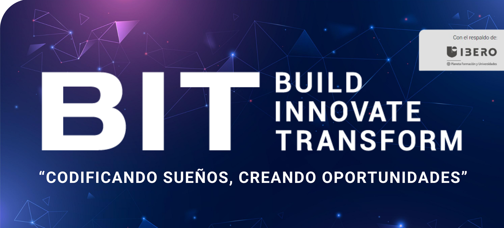

# 👨‍💻 Bogotá Institute of Technology (BIT)  
## Build, Innovate & Transform 💻  
### “Codificando sueños, creando oportunidades”  

---

---

## 🌟 ¿Quiénes Somos?  
Somos una institución educativa líder en **tecnología e innovación** en Latinoamérica. Desde **2016**, estamos transformando vidas mediante la educación tecnológica, cerrando la brecha digital y creando **oportunidades para todos**.  

## 🚀 Nuestra Misión  
Formar a la próxima generación de **desarrolladores**, **líderes tecnológicos** y **emprendedores**, empoderándolos con habilidades prácticas y herramientas innovadoras para enfrentar los desafíos del mundo digital.  

## 📚 Programas Destacados  
- **Desarrollo Web Full Stack** 🌐  
- **Inteligencia Artificial y Machine Learning** 🤖  
- **Diseño UX/UI** 🎨  
- **Análisis de Datos** 📊  
- **Desarrollo Móvil para Android** 📱  

## 👥 Compromiso con la Inclusión  
En BIT, creemos en la **diversidad y la inclusión**. Estamos comprometidos en cerrar la brecha de género en tecnología, con un **35% de participación femenina** en nuestros programas.  

## 📈 Impacto en la Comunidad  
- 🎓 **Más de 10,000 estudiantes** formados.  
- 💼 **72% de empleabilidad** entre nuestros egresados.  
- 🌍 Alianzas con **Banco Mundial**, **BICTIA** y **NORAD** para proyectos educativos de alto impacto.  

---

## 🤝 ¡Únete a Nuestra Comunidad!  
¡Conecta, colabora y aprende con nosotros!  
  
  
  

---

## 📧 ¿Tienes Preguntas?  
Escríbenos a: **admisiones@bitinstitute.online**  

---

## 📜 Licencia  
Este repositorio está licenciado bajo la **MIT License**.  

---

## ⭐ ¡Síguenos y Apoya Nuestra Misión!  
¡No olvides darle una estrella ⭐ a nuestros repositorios y seguirnos para estar al tanto de las últimas innovaciones tecnológicas!  

---

## 💡 ¿Tienes ideas o sugerencias?  
¡Nos encantaría saber de ti! Abre un **Issue** o envía un **Pull Request**. ¡La colaboración es clave para la innovación!  

---

### **🌐 Innovación. 🚀 Educación. 🌍 Impacto.**  
**¡Bienvenidos a BIT, donde los sueños se codifican y las oportunidades se crean!**  

